 >**데이터베이스**란 조직에 필요한 정보를 얻기 위해 논리적으로 연관된 데이터를 모아 구조적으로 통합한 것. 혹은 여러 사람이 공용으로 사용하기 위해 통합하고 저장한 운영 데이터의 집합.

## I. 데이터베이스를 사용하는 이유
**데이터**는 사물이나 현상을 관찰, 분석하여 도출한 실제 값이고, 그 값들에게 의미를 부여하면 **정보**가 된다. 그런 정보들을 모아 사람이 이해할 수 있는 논리로 가공하면 그것이 **지식**이다.
전산화가 기본이 된 현 시대의 대부분의 업무는 계속해서 데이터가 발생한다. 그것들을 효율적으로 저장하고 검색할 수 있도록 하며, 의미있는 논리 구조로 연결지음으로서 원하는 방식으로 재가공할 수 있어야 발전이 가능하다. 데이터베이스는 바로 그것을 위해 존재한다.

## II. 데이터베이스 시스템
**데이터베이스 시스템**은 데이터의 검색과 변경 작업이 주를 이루며, 그 빈도에 따라 구축 난이도가 달라진다. 검색과 변경이 많은 대규모 업무일수록 구축 난이도가 올라간다. 증권 데이터베이스 시스템이 그 예시이다.

## III. 데이터베이스의 특징
데이터베이스로 다루는 데이터의 종류는 크게 네 가지로 나뉜다.
- **통합된 데이터:** 여러곳에서 사용하던 데이터를 통합하여 하나로 저장한 데이터. 통합 과정에서 발생하는 중복을 최소화함으로서 불일치 현상을 없애는것이 관건임.
- **저장된 데이터:** 문서가 아닌 컴퓨터 저장 장치에 저장된 데이터를 의미함.
- **운영 데이터:** 조직에서 어떤 업무를 위해 검색할 목적으로 저장된 데이터. 
- **공용 데이터:** 한 사람, 한가지 목적을 위해 사용되는 데이터가 아니라 여러 사람이 여러 프로그램에서 사용할 수 있는 데이터

데이터베이스의 특징은 다음과 같다.
- **실시간 접근:** 요청한 순간 서버는 클라이언트가 원하는 결과를 응답해줌.
- **지속적인 변화:** 데이터는 삽입, 삭제, 수정으로 인해 계속 변화함.
- **동시 공유:** 같은 시간에 업무를 하는 여러 사람들에게 동시에 공유됨.
- **내용으로 참조:** 물리적 위치가 아닌 사용자가 알고있는 데이터 값으로, 그 값과 함께 조건을 제시하여 검색을 수행함. '학번'이라는 실제 값으로 학사 데이터베이스에서 그 학생의 '성적'이라는 또다른 값을 검색할 수 있는것이 그 원리임. 

## IV. 데이터베이스 시스템의 발전
아날로그 시대에는 수기로 작성하고 사람이 기억했지만, 컴퓨터 기술의 발전과 함께 많은 양의 데이터를 저장할 수 있게 되고, 인터넷이 대중적으로 자리잡으며 활용 분야도 매우 다양해짐.

정보 시스템은 다음과 같이 발전함

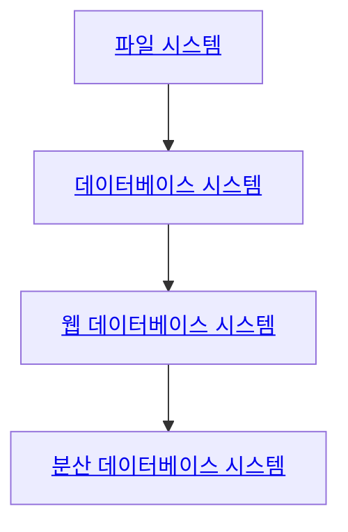

#### 파일 시스템
- 데이터를 파일 단위로 서버에 저장
- 각 컴퓨터들이 서버와 LAN으로 연결하여 응용 프로그램에서 수정
- 여러 컴퓨터가 개별적으로 동시에 파일을 다루므로 중복 및 일관성 훼손 위험

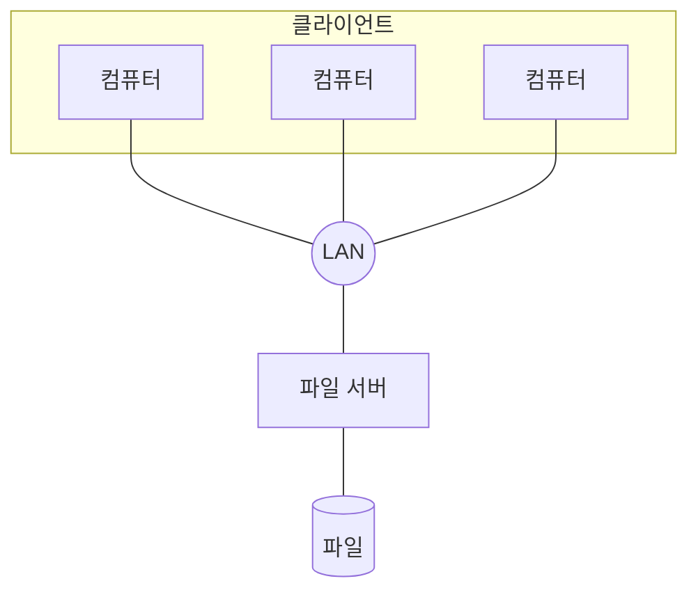

#### 데이터베이스 시스템
- DBMS 도입으로 서버에서 데이터를 통합 관리
- 서버/클라이언트 구조로, 클라이언트가 데이터를 가진 서버에 요청하면 서버가 응답하는 방식
- 서버 혼자서 파일을 다루며 일관성 유지, 복구, 동시 접근 제어
- 저장 전 구조 설계로 중복 방지, 데이터 표준화로 무결성 확보

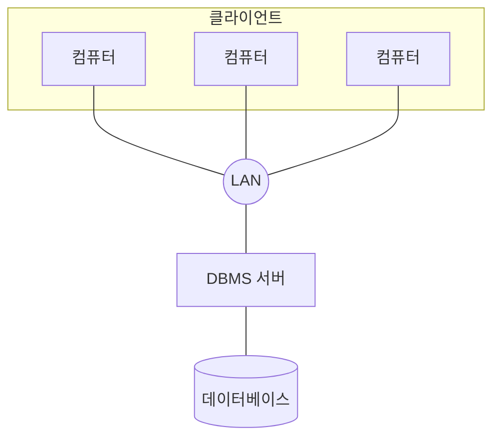

#### 웹 데이터베이스 시스템
- 데이터베이스를 웹 브라우저로 사용할 수 있도록 서비스
- 불특정 다수를 대상으로 하는 고객 응대 시스템에 도입

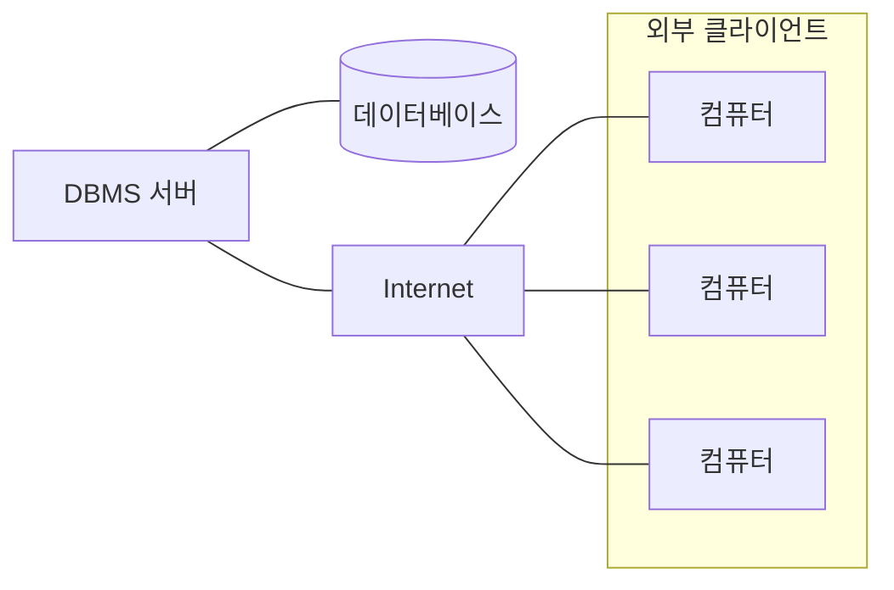

#### 분산 데이터베이스 시스템
- 여러 곳에서 발생한 데이터들을 각각 저장하거나, 그 분산 저장된 데이터들간 상호 연동 작업을 수행
- 대기업으로 갈수록, 서비스 규모가 거대해질수록 필요성이 커짐

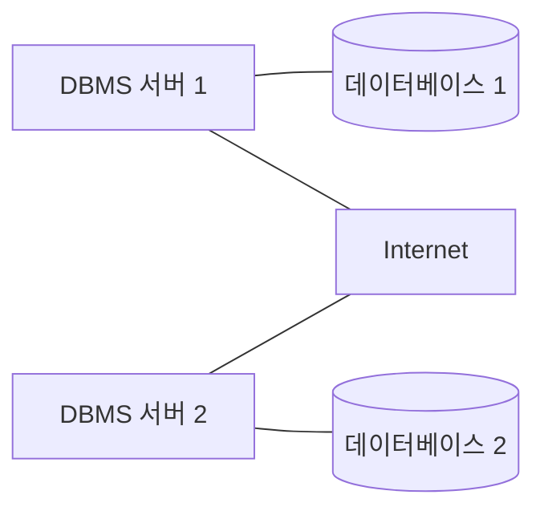

## V. 파일 시스템과 DBMS
데이터는 항상 변경이 일어나기에, 프로그램 내부에 저장하는 방식이 아닌 하드디스크에 물리적으로 저장될 필요가 있음.

**데이터**는 정의와 값으로 구성됨. 두 시스템의 차이는 정의와 값을 관리하는 별도의 주체 유뮤의 차이임.

- **파일시스템:** 프로그램이 종료되어도 데이터가 유지되지만, 데이터 구조가 바뀌면 불편이 따름. 또 여러의 프로그램이 그 데이터를 필요로 할 경우 파일을 동시에 열 수 없다는 문제가 있음.
- **DBMS:** 정의와 값을 소프트웨어가 관리함. 데이터 정의, 데이터 변경을 수행하고 다른 프로그램에서 전용 언어로 접근할 수 있도록 인터페이스를 제공함.

CPU와 램을 더 많이 사용하는건 DBMS지만, 메모장과 같은 별도의 응용프로그램으로 열어야 하는 파일과 달리 SQL언어로 다른 응용프로그램에서 쉽게 접근이 가능함.

>**DBMS의 장점**
>- 데이터 중복 최소화
>- 데이터 일관성 유지
>- 데이터 독립성 유지
>- 관리 기능 제공
>- 개발 생산성 향상
>- 데이터 무결성 유지
>- 데이터 표준 준수 용이

## VI. 데이터베이스 시스템의 구성
데이터베이스의 기본 구성은 다음과 같음
1. **관리 시스템(DBMS)**: 데이터를 관리하는 소프트웨어 시스템. 요청에 응답하고 검색, 삭제, 수정을 수행함.
2. **데이터베이스:** 실제 값들을 모아 저장한 토대. 컴퓨터의 하드디스크에 존재함.
3. **데이터 모델:** 데이터가 저장되는 방식에 대한 논리적 구현. 데이터가 저장되는 스타일.

데이터베이스 언어인 SQL은 다음과 같음
1. **데이터 정의어(DDL):** DBMS에 저장된 테이블 구조를 작성하는데 사용.
에: CREATE, ALTER, DROP
2. **데이터 조작어(DML):** 데이터를 검색, 삽입, 삭제, 수정하는데 사용.
예: SELECT, INSERT, DELETE, UPDATE
3. **데이터 제어어(DCL):** 데이터 사용 권한을 관리하는데 사용.
예: GRANT, REVOKE

데이터베이스 사용자는 크게 네가지로 구분함
- **일반 사용자:** 개발자가 만든 프로그램으로 데이터베이스에 접근하여 업무를 처리하는 사람
- **응용 프로그래머:** 일반 사용자를 위해 데이터베이스에 접근하는 프로그램을 만드는 사람
- **SQL 사용자:** 프로그램으로 조작할 수 없는 데이터베이스 업무를 SQL로 처리하는 사람
- **데이터베이스 관리자( DBA):** 운영 조직의 데이터베이스 시스템을 총괄하는 사람

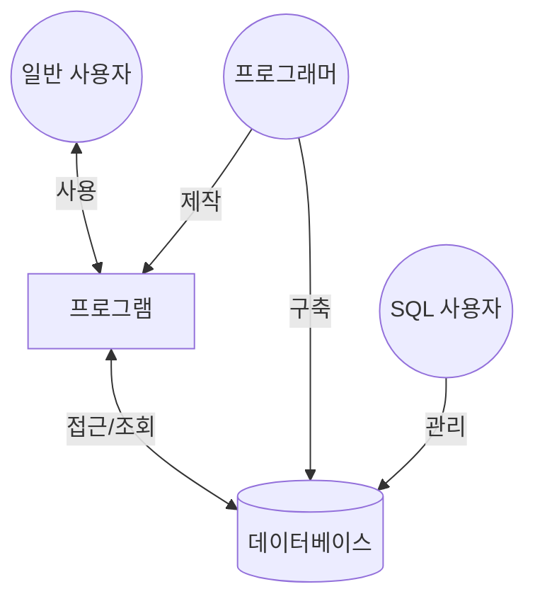

DBMS는 주기억장치에 저장되어 사용자와 데이터베이스를 연결해주는 소프트웨어로, 다음과 같이 구성된다.
1. **DML/DDL 컴파일러:** SQL을 번역함
2. **Embeded DML 컴파일러:** 응용 프로그램에 삽입된 SQL을 번역함
3. **질의처리기:** 번역된 SQL을 처리
4. 이외 트랜잭션 관리자, 파일 관리자, 버퍼 관리자 등

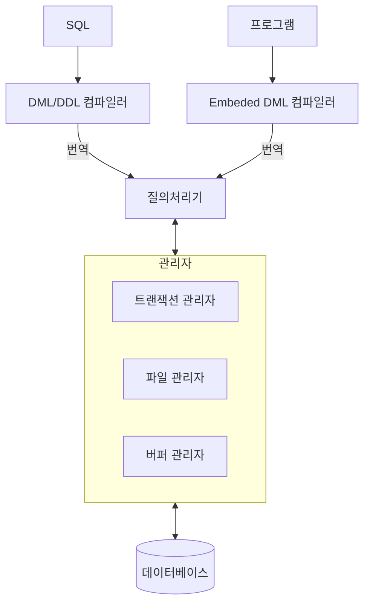

하드디스트에 저장된 데이터베이스는 다음으로 구성됨
1. **데이터 파일:** 실제 데이터가 쓰여진 파일
2. **인덱스:** 원하는 데이터에 빠르게 접근하기 위한 목차
3. **데이터 사전:** 데이터에 대한 정보

DBMS의 주요 기능
- 데이터 정의: 데이터 구조를 정의하고 구조에 대한 삭제 및 변경 수행
- 데이터 조작: 프로그램의 요청에 의해 데이터의 검색, 삽입, 수정, 삭제를 수행
- 데이터 추출: 사용자가 조회하는 데이터를 추출
- 데이터 제어: 데이터베이스 사용자를 생성, 접근 권한 관리. 백업 및 동시성 제어등의 기능을 수행

## VII. 데이터 모델
데이터베이스 시스템에서 데이터를 저장하는 이론적인 방법을 의미. 현재 가장 많이 사용되는 모델은 관계 데이터 모델임. 이외 게층 데이터 모델, 네트워크 데이터 모델, 객체 데이터 모델, 객체-관계 데이터 모델등이 있음.

데이터 모델의 구분 기준은 데이터 간 관계를 표현하는 방법임.

1. **포인터 사용:** 계층 데이터 모델, 네트워크 데이터 모델
데이터에 그와 관계된 다른 데이터의 포인터 값을 저장하여 찾아가는 방법. 빠르지만 개발 생산성 낮음
2. **속성값 사용:** 관계 데이터 모델
데이터에 그와 관계된 다른 데이터의 속성을 저장하여 찾아가는 방법. 느리지만 개발 생산성 높음
3. **객체 식별자 사용:** 객체 데이터 모델
객체의 고유 시별자인 oid를 이용하는 방법. 객체지향 언어의 장점을 결합한 것.

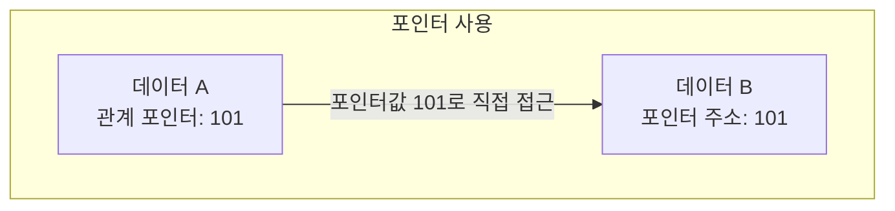
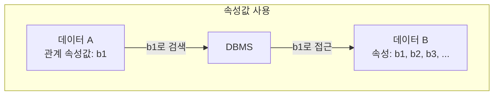
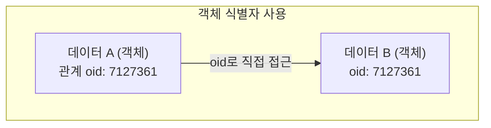

## VIII. 3단계 데이터베이스 구조
데이터베이스 이해를 위해 ANSI에서 제시한 개념이다. 데이터베이스를 보는 관점을 3단계로 분리함으로서 복잡한 구조를 단순화하였다.

1. **외부 스키마:** 일반 사용자/응용 프로그래머가 접근하는 하나의 논리적인 부분을 의미. 여러개일 수 있음. 
2. **개념 스키마:** DBA가 관리하는 전체 데이터베이스의 정의를 의미. 하나만 존재함.
3. **내부 스키마:** 하드디스크에 실제로 저장되는 방법을 의미. 하나만 존재함.

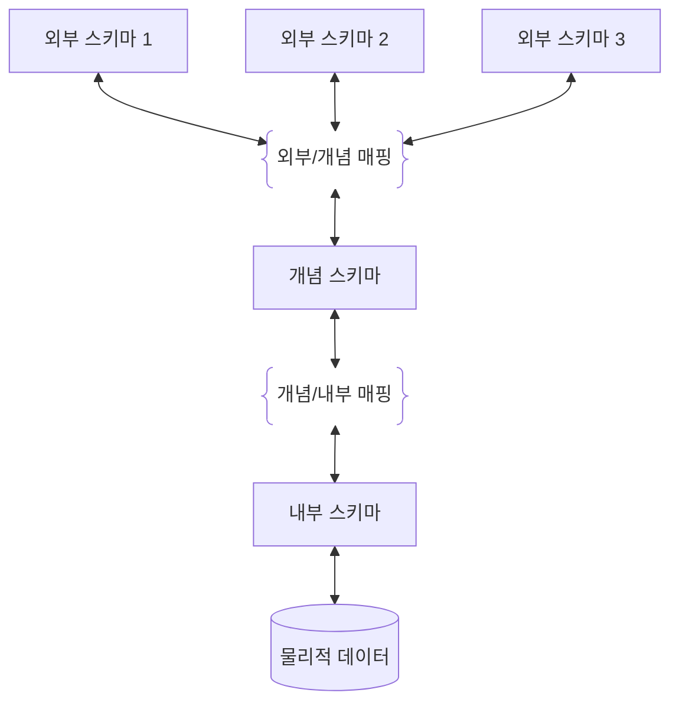

3단계 데이터베이스 구조는 **데이터 독립성**을 표현한다. 데이터 독립성이란 한 단계 내에서 변경이 발생해도 다른 단계엔 영향을 주지 않는것을 의미하며 두 가지로 구분한다.
- **논리적 데이터 독립성(외부-개념):** 논리적 구조등의 변경으로 개념 스키마가 변경되어도 응용 프로그램에는 영향이 없다.
- **물리적 데이터 독립성(개념-내부):** 저장 장치 구조 변경등으로 내부 스키마가 변경되어도 개념 스키마에는 영향이 없다.