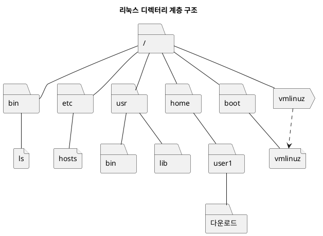

## I. 리눅스의 시작
핀란드 대학생 리누스 베네딕트 토르발스가 처음 개발.
이후 오픈소스 프로젝트가 되어 전 세계의 개발자들이 개발에 참여하며 발전

토르발스는 리눅스 커널을 개발.
커널은 운영체제의 핵심적인 부분이며 응용프로그램도 필요함
GNU 프로젝트가 리눅스 커널에 응용프로그램을 제공

2007년 리눅스 재단이 설립되어 리눅스 개발을 지원, 전세게 수많은 기업과 개발자들이 참여

우분투 리눅스는 다양한 리눅스 배포판 가운데 하나로, 사용자 친화적이며 인기가 많음

## II. 리눅스의 특징
- 리눅스는 공개 소프트웨어이며 누구나 무료로 사용할 수 있다.
- 유닉스와 완벽한 호환성을 유지한다.
- 서버용 운영체제로 많이 사용된다.
- 편리한 GUI 환경을 제공한다.

## III. 리눅스 구조
- **커널:** 프로세스, 메모리, 파일 시스템, 장치 등 모든 컴퓨터 자원을 관리하는 리눅스의 핵심
- **셸:** 사용자가 입력한 명령을 해석해 커널에 넘겨주는 중간 역할(인터페이스)
- **응용 프로그램:** 개발, 문서 편집, 인터넷 브라우저, 네트워크 관련 도구

## IV. 리눅스 명령어
#### 명령어 구조: 명령 \[옵션] \[인자]
명령은 수백가지가 있음.
옵션은 - 또는 --로 시작함. 명령의 사용법을 참조하여 어떤 옵션이 있는지 확인 가능
인자는 명령으로 전달되는 값이며 주로 파일명이나 디렉터리임

명령어 예시: `ls -a /tmp`

#### 기초 명령어

|명령|기능|사용법|
|---|---|---|
|date|날짜와 시간 출력|date|
|clear|터미널 화면이 지워짐|clear|
|man|명령의 사용법을 보여줌|man 명령어|
|passwd|사용자 계정의 비밀번호 변경|passwd 로그인ID|

## V. 리눅스 파일의 종류와 특징
- **일반 파일:** 데이터를 저장하는 파일. 텍스트 파일, 실행 파일, 이미지 파일 등.
- **디렉터리:** 리눅스에선 디렉터리도 파일로 취급. 유닉스의 특성.
- **심벌릭 링크:** 원본 파일을 대신하도록 다른 파일명으로 저장한 파일. 바로가기와 비슷. 
- **장치 파일:** 리눅스 시스템에 부착된 장치를 관리하기 위한 특수 파일.

파일의 종류를 확인하는 명령: `file [파일명]`

#### 계층 구조

리눅스는 파일을 효율적으로 관리하기 위해 계층 구조(트리)를 사용.
모든 디렉터리는 맨처음 루트(/)에서 시작함.

|표현|의미|
|-|-|
|/|루트 디렉터리|
|.|현재 디렉터리|
|..|상위 디렉터리|

우분투의 루트 디렉터리에는 커널을 위한 기본 디렉터리들이 여러개 존재함.

|디렉터리|기능|
|---|---|
|**dev**|장치 파일이 담긴 디렉터리.|
|**home**|사용자 홈 디렉터리가 생성되는 디렉터리.|
|**media**|CD-ROM이나 USB 같은 외부 장치를 연결(마운트)하고 하려는 디렉터리.|
|**opt**|추가 패키지가 설치되는 디렉터리.|
|**root**|root 계정의 홈 디렉터리. 루트(/) 디렉터리와 다른 것이므로 혼동하지 않도록 한다.|
|**sys**|리눅스 커널과 관련된 파일이 있는 디렉터리.|
|**usr**|기본 실행 파일과 라이브러리 파일, 헤더 파일 등 많은 파일이 있다. 참고로 usr는 'Unix System Resource'의 약자이다.|
|**boot**|부팅에 필요한 커널 파일을 가지고 있다.|
|**etc**|리눅스 설정을 위한 각종 파일을 가지고 있다.|
|**lost+found**|파일 시스템에 문제가 발생하여 복구할 경우, 문제가 되는 파일이 저장되는 디렉터리로 보통은 비어 있다.|
|**mnt**|파일 시스템을 임시로 마운트하는 디렉터리.|
|**proc**|프로세스 정보 등 커널 관련 정보가 저장되는 디렉터리.|
|**run**|실행 중인 서비스와 관련된 파일이 저장된다.|
|**srv**|FTP나 Web 등 시스템에 제공하는 서비스의 데이터가 저장된다.|
|**tmp**|시스템 사용 중에 발생하는 임시 데이터가 저장된다. 이 디렉터리에 있는 파일은 재시작하면 모두 삭제된다.|
|**var**|시스템 운영 중에 발생하는 데이터나 로그 등 내용이 자주 바뀌는 파일이 주로 저장된다.|

#### 절대 경로와 상대 경로
- **절대 경로:** 루트 디렉터리에서부터 출발하는 경로명. 작업 디렉터리(현재 디렉터리)가 변해도 가리키는 위치가 같음.
- **상대 경로:** 작업 디렉터이에서 출발하는 경로명. 작업 디렉터리가 어디냐에 따라 다른 위치를 가리킴.

## VI. 디렉터리 사용 명령

|명령|기능|
|-|-|
|pwd|현재 디렉터리 확인|
|cd|디렉터리로 이동|
|ls|디렉터리 내용 보기|
|mkdir|디렉터리 만들기|
|rmdir|빈 디렉터리 제거하기(디렉터리에 파일이 있으면 제거X)|

#### ls 옵션들

|옵션|기능|
|-|-|
|-a|숨김 파일까지 출력|
|-d|디렉터리 자체의 정보 출력|
|-i|첫 번째 행에 inode 출력|
|-l|파일의 상세 정보를 출력|
|-A|. 과 ..를 제외한 모든 파일목록 출력|
|-F|파일의 종류 출력(\*: 실행 파일, /: 디렉터리, @: 심벌릭 링크)|
|-L|심벌릭 링크의 경우 원본 파일의 정보 출력|
|-R|하위 디렉터리 목력까지 출력|

## VII. 파일 사용 명령

|명령|기능|옵션|부가 기능|
|-|-|-|-|
|cat|파일 내용 연속 출력|-n: 행 번호 붙여서 출력|
|more|화면 단위로 파일 내용 출력|+행번호: 출력 시작할 행 지정|/문자열: 내용 검색|
|less|파일 내용을 앞뒤로 스크롤하며 출력||j: 다음 행 스크롤 k: 이전 행 스크롤 Ctrl + f: 다음 화면 Ctrl + b: 이전 화면
|tail|파일 뒷부분의 몇 행을 출력|+행번호: 지정한 행부터 끝까지 출력 -숫자: 출력할 행의 수 -f: 출력을 종료하지 않고 주기적으로 계속 출력|Crtl + c: -f 반복출력 종료
|cp|파일 복사|-i: 덮어쓰기 확인 -r: 디렉터리를 복사할 때 지정|여러 파일을 복사할 때 마지막 인자는 반드시 디렉터리|
|mv|파일 이동, 이름 변경|-i: 덮어쓰기 확인|여러 파일을 이동할 때 마지막 인자는 반드시 디렉터리|
|rm|파일 삭제|-i: 삭제 의사 재확인 -r: 디렉터리를 내용까지 삭제|
|ln|하드링크 생성|-s: 심벌릭 링크 생성|
|touch|빈 파일 생성, 수정 시간 변경|-a: 접근 시간만 변경 -m: 수정 시간만 변경 -t:시간 직접 입력|
|grep|파일에서 내용 검색|-i: 대소문자 모두 검색 -l: 지정한 패턴이 포함된 파일명 출력 -n: 행 번호 출력|
|find|다양한 조건으로 파일 검색|-name: 파일명으로 검색 -type: 파일 종류로 검색 -user LoginID: 소유자로 검색 -perm 접근 권한: 권한으로 검색|-exec 명령 {}\\;: 검색한 파일에 명령 실행 -ok 명령 {}\\;: 사용자의 확인을 받아서 명령 실행 -print:검색된 파일의 절대경로 출력 -ls: 검색 결과를 긴 목록으로 출력|
|whereis|명령어 파일의 위치 찾기|-b: 바이너리 파일만 검색 -m:매뉴얼 파일만 검색 -s:소스 파일만 검색|
|which|명령어의 위치나 에일리어스 출력|
