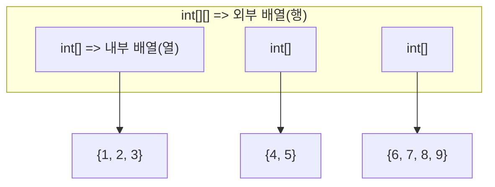

>자바 프로그래밍의 특징은 **항상 클래스에서 시작**한다는 점이다. **클래스 밖에는 어느것도 작성하지 않으며, 프로그램이 시작할 첫 번째 함수는 main 함수**이다.

## I. 클래스
만들 클래스 이름을 파일명으로 한  .java 파일을 만든다. 같은 파일에 두개 이상의 public 클래스를 작성할 수 없으며 클래스 이름과 파일명이 같아야 한다.

```java
// Hello.java
public class Hello {
	// 메서드: 클래스에 종속된 함수
	public static int sum(int n, int m) {
		return n + m;
	}
	// main 메서드: 프로그램의 진입점 함수
	public static void main(String[] args) {
		int i = 20;
		int s = sum(i, 10);
		System.out.println(s);
	}
}
```

출력 결과

```
30
```

하나의 java 파일에는 하나의 public 클래스, 그리고 여러개의 일반 클래스가 작성될 수 있다.
```java
public class Hello {
	public static void main(String[] args) {
		System.out.println(Calc.sum(2, 2));
		System.out.println(Calc.mul(2, 2));
		System.out.println(Calc.pow(2, 2));
	}
}

class Calc {
	public static int sum(int n, int m) {
		return n + m;
	}
	public static int mul(int n, int m) {
		return n * m;
	}
	public static int pow(int n, int m) {
		int result = 1;
		for (int i = 0; i < m; i++) {
			result *= n;
		}
		return result;
	}
}
```

'main()' 메서드는 반드시 `public static void`로 선언되어야 한다. 그리고 전체 프로그램에서 하나만 존재해야 한다.

---

## II. 예약어 및 타입
자바 에약어엔 다음과 같은 것들이 있다.

#### 기본 데이터 타입 (Primitive Data Types)

|**예약어**|**설명**|
|---|---|
|`boolean`|논리 타입. `true` 또는 `false` 값만 가짐.|
|`byte`|1바이트 크기의 정수 타입. $(-128$에서 $127$).|
|`short`|2바이트 크기의 정수 타입.|
|`int`|4바이트 크기의 정수 타입. 가장 일반적으로 사용됨.|
|`long`|8바이트 크기의 정수 타입.|
|`float`|4바이트 크기의 부동 소수점(실수) 타입.|
|`double`|8바이트 크기의 부동 소수점(실수) 타입. `float`보다 정밀함.|
|`char`|2바이트 크기의 문자 타입. 유니코드 문자를 저장.|

#### 접근 제어자 및 모디파이어 (Access Modifiers & Modifiers)

|**예약어**|**설명**|
|---|---|
|`public`|모든 곳에서 접근 가능하도록 허용하는 접근 제어자.|
|`protected`|같은 패키지 또는 상속 관계의 클래스에서 접근 가능.|
|`private`|해당 클래스 내에서만 접근 가능.|
|`abstract`|클래스나 메서드를 추상(미완성)으로 선언.|
|`final`|상수, 상속 불가 클래스, 오버라이드 불가 메서드 선언.|
|`static`|클래스에 속한 멤버를 선언. 객체 생성 없이 사용 가능.|
|`volatile`|변수의 값을 메인 메모리에 저장하여 스레드 간의 가시성을 보장.|
|`transient`|직렬화(Serialization)에서 제외할 필드를 지정.|
|`native`|자바가 아닌 다른 언어(C/C++)로 구현된 메서드임을 명시.|
|`strictfp`|부동 소수점 연산을 IEEE 754 표준에 엄격하게 맞추도록 강제.|

#### 흐름 제어 (Control Flow)

|**예약어**|**설명**|
|---|---|
|`if`|조건에 따라 코드 블록 실행.|
|`else`|`if` 조건이 거짓일 때 실행.|
|`switch`|하나의 표현식으로 여러 경우 중 하나를 선택하여 실행.|
|`case`|`switch` 문 내에서 특정 값과 일치하는 경우를 지정.|
|`default`|`switch` 문에서 일치하는 `case`가 없을 때 실행.|
|`for`|반복 횟수를 알고 있을 때 주로 사용되는 반복문.|
|`while`|조건이 참인 동안 반복하는 반복문.|
|`do`|`while`과 유사하나, 최소한 한 번은 실행을 보장하는 반복문.|
|`break`|반복문이나 `switch` 문을 즉시 종료.|
|`continue`|반복문의 다음 주기로 건너뜀.|
|`return`|현재 메서드를 종료하고 값을 반환.|

#### 예외 처리 (Exception Handling)

|**예약어**|**설명**|
|---|---|
|`try`|예외 발생 가능성이 있는 코드를 감싸는 블록.|
|`catch`|`try` 블록에서 발생한 예외를 처리하는 블록.|
|`finally`|예외 발생 여부와 상관없이 항상 실행되는 블록.|
|`throw`|프로그래머가 고의로 예외를 발생시킴.|
|`throws`|메서드가 처리하지 않고 호출한 곳으로 예외를 던짐을 선언.|

#### 객체 및 클래스 관련 (Object & Class)

|**예약어**|**설명**|
|---|---|
|`class`|객체를 생성하기 위한 틀(설계도)을 정의.|
|`new`|힙(Heap) 메모리에 새로운 객체를 생성.|
|`this`|현재 객체(인스턴스) 자신을 가리킴.|
|`super`|부모 클래스의 멤버(변수, 메서드, 생성자)에 접근.|
|`extends`|다른 클래스를 상속받을 때 사용.|
|`implements`|클래스가 인터페이스를 구현할 때 사용.|
|`interface`|상수와 추상 메서드만 가질 수 있는 설계도 정의.|
|`package`|관련 있는 클래스들을 묶는 단위.|
|`import`|다른 패키지의 클래스나 인터페이스를 현재 코드에서 사용하기 위해 불러옴.|
|`instanceof`|객체가 특정 타입(클래스 또는 인터페이스)인지 확인.|
|`enum`|열거형(상수 집합)을 정의.|
|`void`|메서드가 반환하는 값이 없음을 의미.|
|`assert`|특정 조건이 참임을 단언하고, 거짓일 경우 오류 발생 (디버깅 목적).|

#### 동시성 (Concurrency)

|**예약어**|**설명**|
|---|---|
|`synchronized`|한 번에 하나의 스레드만 접근 가능하도록 동기화 설정.|

**참고:** `enum`은 Java $5.0$부터 추가된 예약어.

---

## III. 문자열
자바에서 문자열 `String`은 JDK에서 제공하는 클래스이며 기본 타입이 아님.
String 클래스는 이렇게 다른 타입과도 + 연산으로 문자열 변환 및 이어붙이기가 가능해 편리함.

```java
public class Hello {
	public static void main(String[] args) {
		String s1 = "Hello";
		String s2 = "World";
		int i = 128;
		
		System.out.println(s1 + s2);
		System.out.println(s1 + i);
	}
}
```

`String` 클래스는 다음과 같은 메서드를 제공한다.

#### 문자열 정보 조회 및 비교

|**메서드**|**용도**|**예시**|
|---|---|---|
|**`length()`**|문자열의 길이를 반환.|`"Hello".length()` $\rightarrow 5$|
|**`charAt(int index)`**|특정 인덱스에 있는 **문자(char)를 반환.|`"Java".charAt(1)` $\rightarrow$ `'a'`|
|`equals(Object anObject)`|두 문자열의 내용이 동일한지 확인. (`==` 연산자는 주소 비교)|`"A".equals("B")` $\rightarrow$ `false`|
|**`equalsIgnoreCase(String str)`**|대소문자 구분 없이 두 문자열의 내용이 동일한지 확인.|`"Java".equalsIgnoreCase("java")` $\rightarrow$ `true`|
|**`indexOf(String str)`**|특정 문자열이 처음으로 나타나는 **인덱스**를 반환. 없으면 $-1$ 반환.|`"Banana".indexOf("an")` $\rightarrow 1$|
|**`contains(CharSequence s)`**|문자열이 특정 문자열을 **포함**하는지 확인.|`"apple".contains("pp")` $\rightarrow$ `true`|
|**`startsWith(String prefix)`**|특정 문자열로 **시작**하는지 확인.|`"file.txt".startsWith("file")` $\rightarrow$ `true`|
|**`endsWith(String suffix)`**|특정 문자열로 **끝**나는지 확인.|`"data.csv".endsWith(".csv")` $\rightarrow$ `true`|

#### 문자열 편집 및 조작

|**메서드**|**용도**|**예시**|
|---|---|---|
|**`substring(int beginIndex)`**|시작 인덱스부터 끝까지 잘라낸 **새로운 문자열** 반환.|`"012345".substring(3)` $\rightarrow$ `"345"`|
|**`substring(int begin, int end)`**|시작 인덱스부터 끝 인덱스 **직전까지** 잘라냄.|`"012345".substring(1, 4)` $\rightarrow$ `"123"`|
|**`replace(CharSequence old, CharSequence new)`**|지정된 문자열을 새로운 문자열로 **모두 치환**.|`"a.b.c".replace(".", "-")` $\rightarrow$ `"a-b-c"`|
|**`replaceAll(String regex, String replacement)`**|**정규표현식(Regex)**과 일치하는 모든 부분을 치환.|`"a1b2c3".replaceAll("[0-9]", "*")` $\rightarrow$ `"a*b*c*"`|
|**`toLowerCase()`**|모든 문자를 **소문자**로 변환한 새로운 문자열 반환.|`"JAVA".toLowerCase()` $\rightarrow$ `"java"`|
|**`toUpperCase()`**|모든 문자를 **대문자**로 변환한 새로운 문자열 반환.|`"java".toUpperCase()` $\rightarrow$ `"JAVA"`|
|**`trim()`**|문자열의 **양 끝**에 있는 공백(whitespace)을 제거.|`" text ".trim()` $\rightarrow$ `"text"`|
|**`concat(String str)`**|문자열을 뒤에 덧붙임. (`+` 연산자와 유사)|`"A".concat("B")` $\rightarrow$ `"AB"`|

#### 문자열 분리 `split()`

```java
String data = "사과,바나나,딸기";
String[] items = data.split(","); // {"사과", "바나나", "딸기"}
```


#### 문자열로 변환 `valueOf`
```java
int num = 123;
String strNum = String.valueOf(num); // "123"
```

#### 문자열 편집기 `StringBuilder`
자바에서 `String` 클래스는 불변(Immutable) 객체임. 따라서 String 객체를 편집하는 모든 작업에서는 새로운 `String` 객체가 생성됨.

```java
String s = "Hello";
System.out.println(s);
System.out.println(System.identityHashCode(s)); // 주소 기반 해시코드 출력

s = "World";
System.out.println(s);
System.out.println(System.identityHashCode(s));
```

```
Hello
326549596 <- 리터럴 "Hello"를 담은 객체의 해시코드
World
1364335809 <- 리터럴 "World"를 담은 새로운 객체의 해시코드
```

주소 기반 해시코드를 출력해보면 알 수 있는데, `String` 객체를 하나 생성한 후 값을 바꿨을 뿐인데 새로운 객체가 만들어진것을 확인할 수 있음.
따라서 메모리 안정성을 위해 하나의 버퍼를 두고 문자열 편집 작업을 계속 하고싶다면, `StringBuilder` 클래스를 사용해야 함.

```java
StringBuilder sb = new StringBuilder();
for (int i = 0; i < 10; i++) {
	sb.append(i);
}
System.out.println(sb.toString());
```

```
0123456789
```

---


## IV. 타입 변환
#### 자동 타입 변환
치환문이나 수식 내에서 타입이 일치하지 않으면, 컴파일러는 작은 타입을 큰 타입으로 자동 변환함

```java
int i = 10;
double l = 3.141592;

System.out.println(i * l); // i가 double 타입으로 변환되어 double * double 연산식이 됨
```

```
31.41592
```

#### 강제 타입 변환
컴파일러가 자동으로 타입 변환을 지원하지 않을땐 다음과 같이 강제 변환이 가능

```java
int i = 100;
byte b = (byte)i;
```

---

## V. 입력 받기 `Scanner`
자바에서는 키 입력을 받기 위해 `Scanner` 클래스를 사용함.

#### `Scanner` 객체 생성

```java
import java.util.Scanner; // util 패키지에서 Scanner 클래스를 임포트

public class Hello {
	public static void main(String[] args) {
		Scanner scanner = new Scanner(System.in); // 표준 입력 스트림
		String s1 = scanner.next();
		System.out.println(s1);
	}
}
```

####  `next()`
`Scanner`는 토큰(공백, 탭, 줄바꿈)을 기준으로 끊어 읽어옴.
`next()` 메서드는 버퍼에 있는 다음 토큰을 가져와 리턴함.
즉
첫 번째 `next()` 호출에서 `Hello World From Java` 를 입력하면,
`Hello` 를 리턴함.
다음 `next()` 호출에서는 입력을 기다리지 않고 바로 `World`를 리턴함

또한 `next`는 입력이 없을 때 엔터를 아무리 눌러도 반환하지 않음. 즉 절대로 빈 문자열 ""를 반환하지 않음.

```java
Scanner scanner = new Scanner(System.in);

String s1 = scanner.next(); // <- Hello World
System.out.println(s1);     // -> Hello

String s2 = scanner.next();
System.out.println(s2);     // -> World

String s3 = scanner.next(); // 입력 대기...
System.out.println(s3);

scanner.close(); // scanner 닫기
```

#### `nextLine()`
`nextLine()`은 입력을 `\n` 토큰으로만 끊어 리턴함. 즉 공백 문자열을 포함할 수 있으며 빈 문자열도 리턴할 수 있음.

```java
Scanner scanner = new Scanner(System.in);

String s1 = scanner.nextLine(); // <- Hello World
System.out.println(s1);         // -> Hello World

String s2 = scanner.nextLine(); // <- From Java
System.out.println(s2);         // -> From Java

scanner.close();
```

---

## VI. 배열
자바에서 배열은 레퍼런스 타입이다. 즉 배열의 주소를 가리킬 객체를 하나 만들고 그걸로 원소에 접근하는 방식이다.
C/C++에서는 주소를 직접 사용해 접근했다면, 자바에서의 배열은 레퍼런스 타입 객체를 이용하는 것.

```java
int[] arr = {1, 2, 3, 4, 5};
for (int i = 0; i < arr.length; i++)
	System.out.println(arr[i]);
```

초기화 없이 배열 객체를 생성하려면 다음과 같다.

```java
int[] arr = new int[10];
for (int i = 0; i < arr.length; i++)
	arr[i] = i + 1; // {1, 2, 3, 4, 5, 6, 7, 8, 9, 10}
```

#### 2차원 배열
2차원 배열을 행과 열의 형태로 표현할 수 있는데, 각 행은 열의 주소를 담고있고, 각 열은 1차원 배열이 된다.
각 행이 다른 1차원 배열 주소들을 가리킬 뿐이므로 열에 해당하는 1차원 배열들은 길이가 달라도 된다.

```java
int[][] arr = {
		{1, 2, 3},
		{4, 5},
		{6, 7, 8, 9}
};
```





이런식으로 배열을 인수로 받을 때, 매개변수 a는 레퍼런스 타입이므로 **배열 값 전체가 복사되는것이 아니라 배열을 가리키는 주소값이 넘어오는 형태**가 된다. <- **레퍼런스 치환**

```java
public static int ArrSum(int[][] a) {
	int sum = 0;

	for (int i = 0; i < a.length; i++)
		for (int j = 9; j < a[i].length; j++)
			sum += a[i][j];
	
	return sum;
}
```

#### 레퍼런스 치환
레퍼런스 치환이란 레퍼런스 타입 변수가 가리키는 메모리 주소를 바꾸는 것이다.

다음과 같이 두 배열이 있다고 해보자.

```java
int[] arr1 = {1, 2, 3, 4};
int[] arr2 = {101, 102, 103, 104};
```

`arr2` 에는 엄밀히 말하면 `{101, 102, 103, 104}` 가 저장되어 있는게 아니라 메모리카드 어딘가에 존재할  `{101, 102, 103, 104}` 의 주소값이 저장되어 있는것이다.

따라서 `arr2` 에 `arr1` 대입하면, `arr2`는 `{101, 102, 103, 104}` 를 가리키지 않고 `{1, 2, 3, 4}`의 주소를 가리키게 된다.

**이것은 복사에 의한 전달이 아니라, 참조에 의한 전달이다.**

```java
int[] arr1 = {1, 2, 3, 4};
int[] arr2 = {101, 102, 103, 104};

arr2 = arr1;

System.out.println(arr1);
System.out.println(arr2);
```

같은 주소값이 출력되는것을 볼 수 있다.

```java
[I@1376c05c
[I@1376c05c
```

 ```mermaid
 flowchart
  arr1 --> a["1376c05c"]
  arr2 --> b["51521cc1"]
  a --> ad["{1, 2, 3, 4}"]
  b --> bd["{101, 102, 103, 104}"]
 ```

`arr1 = arr2` 이후:

 ```mermaid
 flowchart
  arr1 --> a["1376c05c"]
  arr2 --> a
  a --> ad["{1, 2, 3, 4}"]
 ```

---

## VII. 반복문

#### for

기본 반복문 문법은 **(초기식; 조건식; 증감식)** 으로, C와 동일하다.

```java

for (int i = 0; i < 10; i++) {
}
```

#### for-each

배열을 순회할 때 for-each 문법을 사용하여 코드를 간소하게 만들 수 있다.

```java
public static int ArrSum(int[][] a) {
	int sum = 0;
	
	// for each
	for (int[] x : a)
		for (int y: x)
			sum += y;
	
	return sum;
}
```

#### while

while문과 continue, break 모두 C와 동일하다.

```java
// 증감과 조건식
int i = 0;
while (i < 10) {
	i++;	
}

// 무한루프와 break
while (true) {
	i += 1;
	if (i == 100) {
		break;
	}
}
```


---

## VIII. 예외 처리

예외란 응용 프로그램 실행 중 발생한 예기치 못한 상황으로, 치명적인 오류를 일으킨다.
자바 플랫폼이 예외로 잡아내는 상황중엔 다음과 같은 것들이 있다.

- 정수를 0으로 나누는 경우
- 배열의 크기보다 큰 인덱스로 배열의 원소를 접근하는 경우
- 존재하지 않는 파일을 읽으려고 하는 경우
- 정수 입력을 기다리는 코드가 실행되고 있을 때, 사용자가 문자를 입력한 경우

따라서 코드 중 문제 발생의 소지가 있는 중요한 부분에서는 `try-catch` 구문을 통해 예외가 발생했을때의 대처를 설계할 수 있다.

```java
try {
	// 실행할 코드
}
catch (예외 클래스) {
	// 예외 처리 코드
}
finally {
	// 예외 발생여부 상관없이 실행할 최종 코드
}
```

#### 예외 클래스

어떤 종류의 예외인지 명시하고 오류 메세지를 포함하는 클래스이다. `catch` 안에 선언한다.

| **예외 타입 (예외 클래스)**                 | **예외 발생 경우**                                                               | **패키지**     |
| ---------------------------------- | -------------------------------------------------------------------------- | ----------- |
| **ArithmeticException**            | 정수를 0으로 나눌 때 발생                                                            | `java.lang` |
| **NullPointerException**           | `null` 레퍼런스를 참조할 때 발생                                                      | `java.lang` |
| **ClassCastException**             | 변환할 수 없는 타입으로 객체를 변환할 때 발생                                                 | `java.lang` |
| **OutOfMemoryError**               | 메모리가 부족한 경우 발생                                                             | `java.lang` |
| **ArrayIndexOutOfBoundsException** | 배열의 범위를 벗어나 접근 시 발생                                                        | `java.lang` |
| **IllegalArgumentException**       | 잘못된 인자 전달 시 발생                                                             | `java.lang` |
| **IOException**                    | 입출력 동작 실패 또는 인터럽트 시 발생                                                     | `java.io`   |
| **NumberFormatException**          | 문자열이 나타내는 숫자와 일치하지 않는 타입의 숫자로 변환 시 발생                                      | `java.lang` |
| **InputMismatchException**         | `Scanner` 클래스의 `nextInt()`를 호출하여 정수로 입력받고자 하였지만, 사용자가 'a' 등과 같이 문자를 입력한 경우 | `java.util` |


```java
int intArray [] = new int[5]; // 인덱스는 0~4까지 가능
try { 
	intArray[3] = 2; // 예외 발생하지 않음 
	intArray[6] = 5; // 예외 발생(배열 길이 초과)
} 
catch (ArrayIndexOutOfBoundsException e) { // 객체 e에 예외 정보가 넘어옴
	System.out.println("배열의 범위를 초과하여 원소를 접근하였습니다."); 
}
```