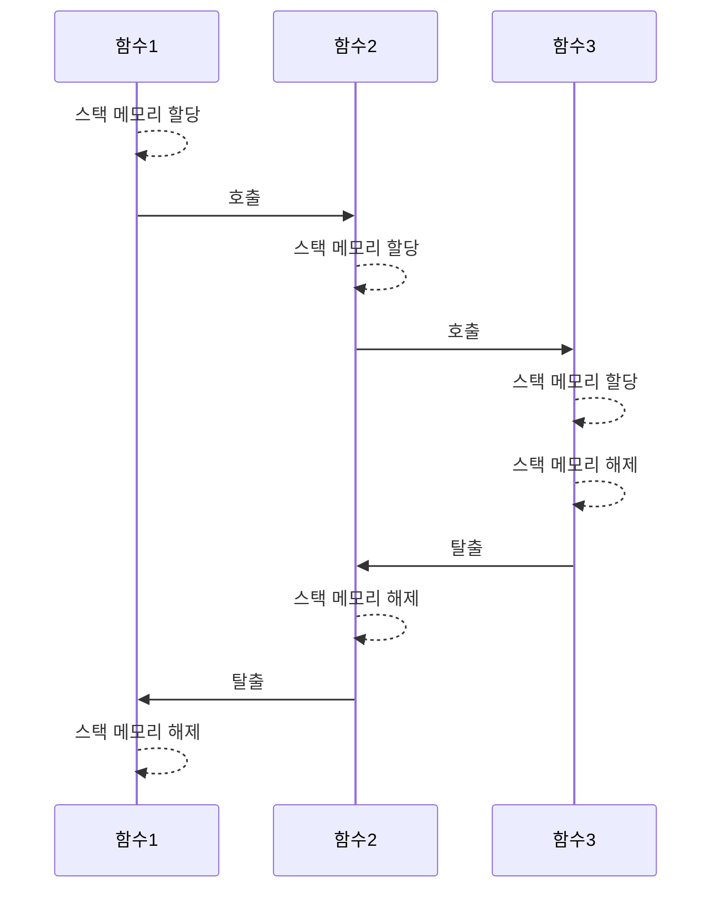
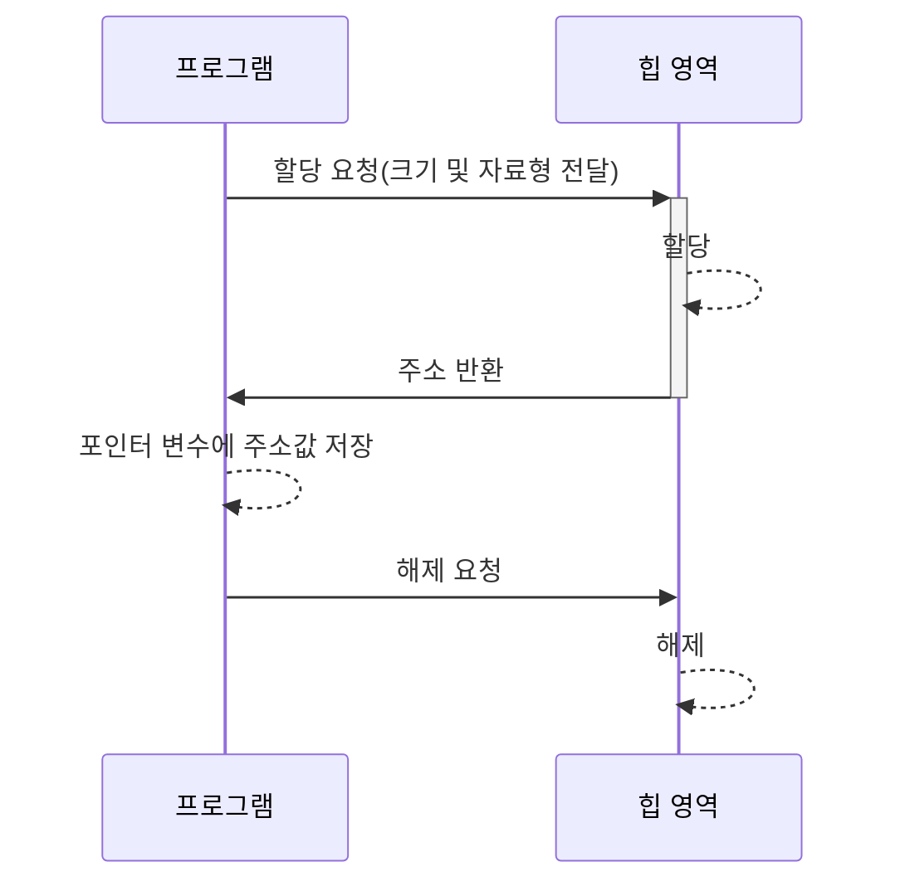

## I. 메모리 구조

>메모리는 데이터 영역, 힙 영역, 스택 영역으로 구분할 수 있다. 프로그램이 시작되면 이 세가지 영역이 RAM에 만들어지고, 각 영역의 목적에 따라 작동하게 된다.

#### 데이터 영역
컴파일 타임에 그 크기가 정해지고, 시작부터 종료까지 유지되는 영역이다. 즉 새로운 할당이나 해제가 발생하지 않는다. 이 데이터 영역에는 다음과 같은 변수가 저장된다.
- 전역 변수: 함수 내부에 선언되지 않은, 가장 바깥쪽에 선언된 변수이다. 같은 소스파일이거나 헤더 파일에 선언이 포함되어있다면 어디서든 접근할 수 있다.
- 정적 변수: static 키워드로 초기화된 변수이다. 함수 내에 선언되어 있다면 지역의 구분에 따라 접근하지 못할 수도 있지만, 그 함수가 종료되더라도 저장 공간을 유지한다.

*정적 전역 변수?*
전역 변수에 static 키워드를 붙이면 정적 전역 변수가 된다. 이러한 변수는 같은 파일 내에서만 접근을 허용한다. 전처리로 헤더 파일을 포함하더라도 말이다.
이를 쓰는 이유는 중복된 이름을 방지하고 민감한 데이터를 외부로부터 은닉하기 위함에 있다. 

```c
int globalInt = 0; // 전역 변수
static int sgInt = 0; // 정적 전역 변수

void func1()
{
	static int staticInt = 0; // 정적 지역 변수(함수가 종료되어도 유지)

	// 전역 변수 접근 가능
	globalInt = 1;
	sgInt = 1;
}
```

#### 스택 영역
한 층씩 쌓아 올리며, 뺄 때는 위에서부터 빼는 후입선출 형태의 적재 구조를 스택(stack)이라고 부르는데, 스택 영역은 이 용어에서 비롯된 표현이다.
함수 호출 시 호출자 지역 위에 피호출자 지역이 쌓이고, 피호출자 함수가 탈출하면 호출자 지역으로 되돌아와 다음 명령어를 실행해 나간다. 이 과정에서 크고 작은 메모리 공간의 할당과 해제가 시스템에 의해 자동으로 일어나는데, 이러한 스택 구조에 의해 할당/해제가 반복되는 메모리 영역을 스택 영역이라고 부른다.



스택 영역은 컴파일 시 그 크기가 미리 정해진다는 특징이 있다. 정해진 크기 안에서 할당/해제가 일어날 뿐이기에 재귀 함수와 같은 알고리즘으로 반복적인 할당이 발생한다면 스택 오버플로우가 발생할 위험이 존재한다.

#### 힙 영역
개발자의 의도에 따라 자유로운 할당/해제가 이루어지는 메모리 영역이다. 스택 메모리 영역은 시스템이 정한 규칙과 크기를 따라야 하지만, 힙 메모리 영역은 필요에 따라 원하는 시점에 할당/해제가 가능하다.
프로그램은 할당과 해제를 위해 프로그램 실행 중에도 주소값을 통해 메모리와 실시간으로 직접 소통한다. 이러한 작업을 동적 메모리 관리라고 부른다.

*동적 메모리 관리는 매우 중요하다!*
어떤 프로그램이든 처음부터 모든 데이터를 가지고 시작하지 않는다. 계산기 같은 간단한 프로그램도, 사용자가 얼마나 많은 계산을 할건지에 따라서 계산 결과를 저장할 메모리 크기는 천차만별이다. 처음부터 최대 200개의 계산 결과까지만 저장할 수 있도록 프로그램을 만든다면, 한두개의 간단한 계산만 하고 끝내는 사람에겐 메모리 낭비이며, 수백 수천개를 계산하는 사람에게는 턱없이 부족하다. 
프로그램이란 어떤 사용자에게나 동일한 기능을 보장해야 하므로, 힙 영역을 잘 활용함으로서 필요에 맞게 메모리를 관리하는 작업은 매우 중요하며, 이는 프로그램의 근간을 다지는 일이다.



---

## II. 배열

>배열은 같은 타입의 값을 여러개 저장하도록 연속된 메모리 주소로 할당된 저장 공간이다. 16진수로 표현되는 메모리 주소를 자료형의 크기만큼 연속적으로 지정하여 배열의 공간을 만든다. 인덱스를 이용한 산술 연산으로 원하는 위치에 빠르게 접근할 수 있으며 선언과 사용이 간결하다.

배열은 다음과 같이 선언한다.
```c
int arr2[5] = { 1, 4, 2, 3, 2 }; // 초기화 선언: 직접 크기 지정
int arr3[] = { 1, 4, 2, 3, 2 };  // 초기화 선언: 자동 크기 지정
int arr1[10];					 // 미초기화 선언: 크기 지정 필수
int arr4[128] = { 0, };			 // 초기화 선언: 모든 값을 0으로 초기화
```

배열의 사용은 다음과 같다.
```c
int iArr[20] = { 0, };

iArr[12] = 1;	  // 배열의 특정 값 수정
int i = iArr[12]; // 배열의 특정 값 읽기
```

*배열 이름은 첫 번째 인덱스의 메모리 주소이다.*
배열 접근 연산은 첫번째 메모리 주소 + (자료형 크기 * 인덱스) 이다. 그렇기 때문에 배열 변수를 [n]과 같은 인덱스를 지정하지 않으면 그 자체로 메모리 주소를 갖는다. 이는 곧 포인터 변수라는 의미이다.

---

## III. 포인터

>포인터란 할당된 메모리 주소에 직접 접근하는 방법으로, 이를 위해 주소를 값으로 저장하는 포인터 변수를 활용한다.

#### 포인터 변수 선언
`*` 연산자를 활용해 포인터 변수를 선언할 수 있고, const 키워드와 조합해 포인터를 상수로, 또는 값을 상수로 만들 수 있다.

```c
int* ptr1;						  // 미초기화 선언
int* ptr2 = NULL;				  // NULL 초기화 선언
const int* c_ptr1 = NULL;		  // 포인터가 가리키는 값이 상수
int* const c_ptr2 = NULL;         // 포인터 자체가 상수
const int* const cc_ptr = NULL;   // 포인터와 가리키는 값 모두 상수
```

*포인터 변수 초기화 시 주의할 점*
미초기화 선언은 대부분의 경우에서 권장되지 않는다. 임의로 중요한 데이터의 주소값으로 지정된다면 위험을 초래할 수 있기 때문이다.
포인터 자체를 상수로 하여 선언할 때, 초기화하지 않으면 컴파일 오류를 일으킨다. 다만 NULL로 초기화 시 어떻게도 활용할 수가 없는 변수가 되어버리므로, 프로그램에서 활용할 유의미한 주소값으로 초기화 해야한다.

#### 포인터 변수의 사용

- 연산자 `&`: 일반 변수 앞에 오면 주소를 반환
- 연산자 `*`: 포인터 변수 앞에 오면 실제 값을  반환 (역참조라고 표현함)

포인터 변수에 주소를 저장하는 과정은 다음과 같다.

```c
int* ptr;      // 포인터 변수 ptr
int num = 16;  // 일반 변수 num

ptr = &num; // num의 주소값을 ptr에 저장
*ptr = 8;   // 실제 값에 접근, 수정
```

`*` 연산자를 포인터 변수 앞에 붙여 실제 값에 접근할 수 있다. 이것을 '역참조'라고 한다. 역참조를 사용하면 지역에 상관 없이 값에 직접 접근하여 처리할 수도 있다. 이는 대량의 데이터를 값 복사 없이 처리할 때 매우 유용하다.

```c
void ptrFunc(int* ptr)
{
	*ptr = 8; // 지역에 관계 없이 직접 접근
}
```

*포인터는 왜 사용할까?*
포인터는 사물함에 비유할 수 있다. 목욕탕에 가서 요금을 내면, 우린 물건을 담을 사물함을 통째로 받는것이 아니라 사물함의 특정 칸의 번호가 적힌 열쇠를 받는다. 사용자가 그 열쇠를 잃어버리지 않는 한, 얼마든지 자신의 사물함으로 찾아가 물건을 보관하거나 필요한걸 꺼낼 수 있다. 포인터를 사용한다는 것은 바로 그런 의미이다. 이때 번호가 적힌 열쇠는 포인터 변수 그 자체라고 볼 수 있다.

